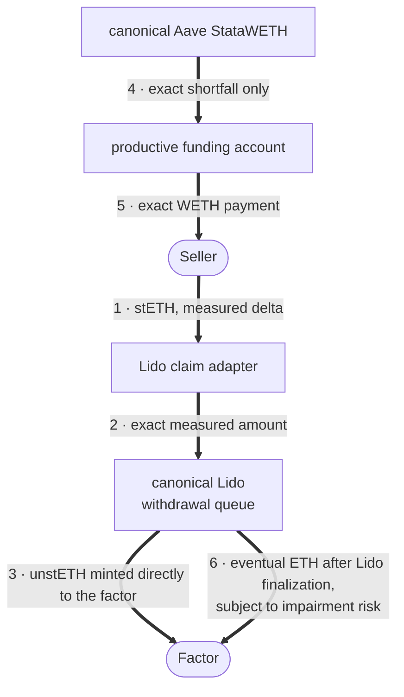
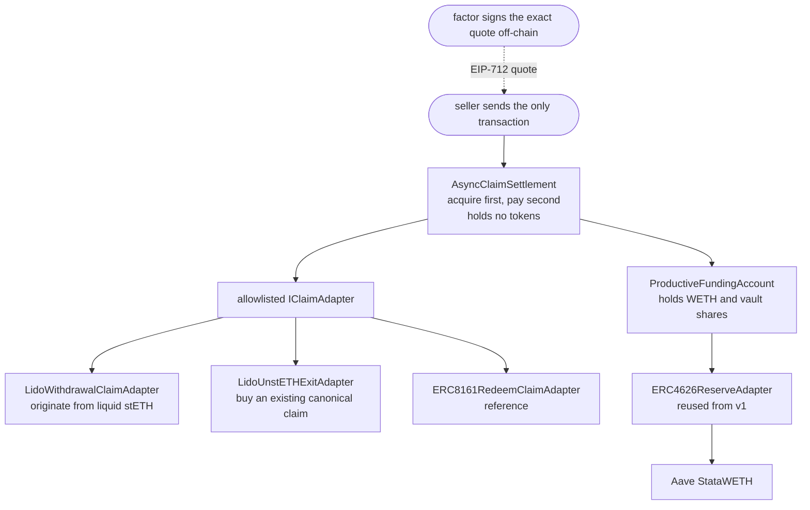

# Intentional

> **Future protocol cash flow → immediate WETH, atomically.**

[Web app](https://intentional.so) ·
[Source](https://github.com/zkoranges/intentional) ·
[Production fork proof](https://github.com/zkoranges/intentional/actions/workflows/production-fork-proof.yml) ·
[ETHGlobal provenance and track record](docs/ETHGLOBAL_SUBMISSION.md)

Intentional is an onchain-factoring product powered by the Reservoir v2
state-contingent settlement engine.
A seller receives an exact, factor-signed payment if and only if the complete
quoted claim is irrevocably acquired in the same transaction. The factor's
standby WETH stays productive in Aave StataWETH until that payment is needed.

## Aqua intent proof

Reservoir also proves a production-shaped, transaction-native intent on
canonical Aqua:

```text
maker: ship one reusable wstETH/WETH strategy to Aqua
taker: exact wstETH input + fixed recipient + minimum WETH + deadline
fill:  quote and settle atomically while maker inventory stays in Aave vaults
```

Run it against the current Ethereum mainnet head:

```sh
ETH_RPC_URL="https://your-mainnet-rpc.example" make demo-aqua-intent
```

The proof uses production Aqua, Lido stETH/wstETH, WETH, and Aave
StatawstETH/StataWETH bytecode. It obtains test inventory through canonical
Lido and WETH deposit calls on a disposable fork; it does not replace any
protocol or mint protocol tokens with a test helper. The maker authorizes the
reusable strategy through `Aqua.ship`. The transaction sender is the taker,
and SwapVM enforces the exact input call, explicit output recipient, minimum
output, and deadline. See
[`docs/AQUA_INTENT_DEMO.md`](docs/AQUA_INTENT_DEMO.md).

Reservoir contains two production proofs built around productive reserves.
The Aqua proof executes through SwapVM. The async-claim settlement is a
separate v2 kernel and does not execute through Aqua.

The first product proof is Lido factoring. One transaction, claim acquired
before any money moves:



Every token movement, gate, and measurement is traced against the deployed
source in [`docs/FUNDS_FLOW.md`](docs/FUNDS_FLOW.md).

The standards-hard reference path handles an ERC-7540/ERC-8161 request that
changes after quote signing:

```text
quote:       100 Pending +  0 Claimable
fill:         60 Pending + 40 Claimable
settlement:   transfer 60 + redeem 40 + verify both
payment:      exact fixed WETH, only after complete acquisition
```

Both versions were built during this hackathon. Reservoir v1 is the
Aqua/SwapVM ERC-4626 reserve engine; v2 is a separate claim-settlement kernel
that reuses v1's generic ERC-4626 reserve adapter.

This is an unaudited hackathon beta. Mainnet funding is deliberately separate
from deployment and occurs only after the exact chain-1 rehearsal, full test
matrix, frontend checks, and AI-assisted release review.

**Current deployment status (2026-07-26): live pre-alpha.**
[Intentional](https://www.intentional.so) serves real, short-lived firm quotes
for stETH origination and existing unstETH claims. The active deployment uses
a fresh factor key, five source-verified contracts, canonical Lido, and a
productive Aave StataWETH reserve. Its independently checked addresses,
receipts, and runtime hashes are in
[`deployments/mainnet-pre-alpha-001.json`](deployments/mainnet-pre-alpha-001.json).

The browser-driven existing-claim sale is proven on mainnet:

- [`0x36de5e1d…4aa9`](https://etherscan.io/tx/0x36de5e1d760959462a5c78ea9215b17a67d03666ee4dcb1ecd34c59851ed4aa9),
  block 25,613,522 — `unstETH #130880` moved from the seller to the
  factor and exactly `0.0049875 WETH` reached the seller atomically.
- Kernel `0x906e0f4583834d44d55f26f0D6Ac842FafdCCcc5`, origination adapter
  `0xe32f43D326a4c104365D8C9ACC657c90C8E03f81`, and existing-unstETH
  adapter `0x645193BC4748109f9A7e582B00ac7D41208BF91F`.
- After that fill, the factor replenished exactly `0.005 WETH`. Subsequent
  browser-driven fills reduced the reserve again; the app and signer now
  publish current capacity from chain and admit quotes only while aggregate
  signed payment liabilities fit. Inventory remains in canonical Aave
  StataWETH between fills.

Quotes use disclosed operator pricing (25 bps), not an oracle or discovered
market price. The live proof demonstrates custody, atomicity, real protocol
integration, and a working public flow; it does not establish market demand.
The older Aqua and origination receipts remain historical companion evidence
in [`docs/MAINNET_MICRO_DEMO.md`](docs/MAINNET_MICRO_DEMO.md).

**Bytecode attestation for the two explorer-unverified contracts** (Etherscan
source verification remains pending despite byte-exact local creation and
runtime attestations; verify locally in seconds):

```sh
# Router — expect 0xd8ac4a51d5994d12b862a303c471237bd28a497b6360c382cab3752977bf0519
cast keccak "$(cast code 0x15a82271F280D4D1485CCE1980AC3C3799b483D9 --rpc-url "$ETH_RPC_URL")"
# Maker — expect 0x553ff057aaa9b0172b6720e7889fddaf575c3213febfe0472065a231be646937
cast keccak "$(cast code 0x9B0B0b6a9fb88Dc556795fe02BE7A73c25b781F6 --rpc-url "$ETH_RPC_URL")"
# Both creation transactions carry calldata equal to `forge inspect <artifact> bytecode`
# plus the constructor args recorded in deployments/mainnet-aqua.json.
```

The paused deployment, capped funding, Etherscan verification,
single-operation activation, and read-only binding-verification procedure is
frozen in [`docs/LIVE_ACTIVATION.md`](docs/LIVE_ACTIVATION.md). The active
pre-alpha followed that procedure with the fresh addresses in the release
manifest. A separate earlier proof deployment was retired after recovery and
remains permanently paused; its receipts are retained only as historical
evidence. This remains unaudited hackathon software.

## Uniswap payouts — be paid in the asset you choose

The payout layer decouples the payout currency from the funding currency: the
factor still underwrites and funds in WETH, and a live
[Uniswap Trading API](https://developers.uniswap.org/docs/trading/swapping-api/integration-guide)
route converts the exact advance and delivers the seller's chosen asset in the
same atomic fill. The payout asset is a **signed quote field** behind a
factor-controlled allowlist — any-asset by design, native ETH deliberately
excluded.

```text
seller stETH -> canonical Lido claim minted to factor
             -> exact WETH materialized from Aave StataWETH
             -> Uniswap API route executes through an immutable proxy
             -> seller receives at least the signed minimum USDC
```

Integration surfaces: [`src/payouts/`](src/payouts/) (settlement, executor,
types), [`frontend/scripts/create-uniswap-payout-quote.mjs`](frontend/scripts/create-uniswap-payout-quote.mjs)
(operator quote CLI with full route validation),
[`frontend/scripts/fetch-uniswap-route.mjs`](frontend/scripts/fetch-uniswap-route.mjs)
(fixture fetcher), [`test/fork/UniswapPayoutSpike.t.sol`](test/fork/UniswapPayoutSpike.t.sol)
(Gate 0 proof, 10 assertions),
[`test/fork/UniswapPayoutMainnet.t.sol`](test/fork/UniswapPayoutMainnet.t.sol)
(canonical fork proof: live route, success + atomic forced failure). API
findings are recorded in [`FEEDBACK.md`](FEEDBACK.md). In both live-route
proofs the printed delivered output matched the API quote to the unit — an
observation from the logs, not an assertion; the asserted bounds are
delivered > 0 in the spike and at least 99% of the quote in the fork proof.
The payout stack is fork-proven and not yet deployed to a persistent network.

## What is working

- Non-upgradeable EIP-712 settlement kernel with EOA and ERC-1271 signatures.
- Seller-called, fill-or-kill execution with nonce, nonce-floor, cancellation,
  15-minute maximum quote lifetime, pause, and mutable adapter allowlist.
- Productive WETH funding with pause, top-up, exact materialization, and
  paused asset/share recovery.
- Lido origination adapter that measures stETH transfer rounding, reads live
  queue bounds and pause state, reconciles the minted unstETH, and leaves no
  flow dust.
- Existing-unstETH adapter that acquires the seller's exact canonical Lido NFT
  and verifies owner, request amounts, share amounts, and claimed state before
  payment.
- ERC-7540/8161 adapter that acquires Pending and Claimable legs in one fill
  using measured deltas and signed rate floors.
- Canonical mainnet-fork tests for Lido, stETH, WETH, Aave V3 StataWETH/
  StataUSDC, and official Aqua through the modified Reservoir SwapVM router.
  Canonical SwapVM runtime presence is checked separately. Fork acceptance
  imports no protocol mock.
- Public dark frontend with injected-wallet connection, canonical Lido
  originate/claim operations, and an owned-unstETH sale flow from real firm
  offer through exact NFT approval and atomic settlement. It fails closed
  unless a fresh active deployment and quote desk are pinned.
- Offline factor quote CLI; no factor key is present in the browser or repo.

No production ERC-8161 endpoint is claimed. That adapter remains a
standards-conformant reference until a reviewed live vault implements the
required interfaces.

## The live product rehearsal

Requirements:

- Foundry v1.7.1;
- Node.js 22.13 or newer;
- GNU Make; and
- an archive-capable Ethereum RPC.

Initialize the exact pinned dependencies:

```sh
git submodule update --init --recursive
npm --prefix frontend ci
```

Run the exact release contracts on a disposable chain-1 fork:

```sh
ETH_RPC_URL="https://your-archive-mainnet-rpc.example" make live-product-e2e
```

For the final live browser fill, use `make jury-ui`. It keeps the disposable
fork alive, starts a build-pinned local frontend, and prints a disposable
seller key plus single-use quote. Follow the safety instructions in
[`docs/JURY_DEMO.md`](docs/JURY_DEMO.md); never use or fund that key on a
persistent network.

The manually dispatched
[`production fork proof`](.github/workflows/production-fork-proof.yml)
workflow reproduces the complete fork suite and the same product rehearsal in
GitHub Actions. Its RPC input is used read-only; every state-changing call is
sent only to the disposable local Anvil fork.

The rehearsal refuses any chain other than chain 1 and any block other than
`25,604,561`. It generates fresh disposable signers, deploys the release
contracts, wraps and deposits real WETH into canonical Aave StataWETH, obtains
real stETH through canonical Lido, generates a target-chain-timestamped quote,
and fills it through the same ABI/envelope used by the web app.

The asserted output is intentionally short and distinguishes the separate
Aqua/SwapVM companion fork proof from the Lido/Aave settlement:

```text
companion Aqua/SwapVM reserve swap passed in a separate fork test
exact stETH approval
canonical unstETH minted to factor
Lido shares acquired
exact WETH seller payment
remaining productive reserve NAV
```

This is not a mocked simulation. The only disposable pieces are the newly
deployed Reservoir contracts and user accounts. Protocol calls target
production bytecode at pinned historical state.

## Complete verification

```sh
forge fmt --check
forge build
make test
ETH_RPC_URL="$ETH_RPC_URL" make test-fork
npm --prefix frontend run lint
npm --prefix frontend test
npm --prefix frontend run build:vercel
```

Release record on 2026-07-25:

| Surface | Result |
|---|---:|
| Deterministic Foundry suites | 252 passed, 0 failed, 0 skipped |
| Production-contract fork suites | 21 passed against canonical contracts; fail loudly if misconfigured |
| Exact deploy/sign/approve/fill rehearsal | passed |
| Frontend rendered/source tests | 18 passed |
| Quote-desk tests | 32 passed |
| Existing-unstETH deploy/sign/approve/fill rehearsal | passed |
| Native Next.js/Vercel build | passed |

Fork methodology and every canonical/disposable boundary are documented in
[`docs/V2_FORK_REALISM.md`](docs/V2_FORK_REALISM.md).

## Web app

The frontend connects an injected wallet and enforces Ethereum mainnet. It:

- checks canonical Aqua and SwapVM runtime presence and reads live stETH, WETH,
  Lido queue, and StataWETH state;
- shows the wallet's balances and recent unstETH requests;
- uses exact approval and simulation before canonical Lido origination;
- claims finalized unstETH through the canonical queue;
- lists seller-owned unstETH and requests a seller- and request-bound firm
  offer from the operator desk without a JSON handoff;
- requires the exact pinned kernel/adapter, then validates hashes, signature,
  seller, request economics, nonce, deadline, funding capacity, ownership, and
  exact NFT approval; and
- simulates before fill, then independently checks the seller's canonical WETH
  delta and canonical Lido request owner/share amount in addition to the bound
  `ClaimSettled` event.

The factor creates quotes outside the browser:

```sh
ETH_RPC_URL=... \
FACTOR_PRIVATE_KEY=... \
KERNEL_ADDRESS=... \
LIDO_ADAPTER_ADDRESS=... \
SELLER_ADDRESS=... \
REQUESTED_STETH=0.9 \
PAYMENT_WETH=0.89775 \
npm --prefix frontend run quote:lido > /tmp/reservoir-quote.json
```

Never commit quote files, private keys, RPC URLs, Vercel credentials, or
deployment environments. See [`frontend/README.md`](frontend/README.md).

## Architecture



A full walkthrough of the funds flow — both settlement paths, the factor's
capital cycle, every validation gate and the error it reverts with, and the
live mainnet settlement decoded wei by wei — is in
[`docs/FUNDS_FLOW.md`](docs/FUNDS_FLOW.md).

[`AsyncClaimSettlement`](src/claims/AsyncClaimSettlement.sol) validates the
sealed core configuration, seller, buyer-side claim destinations, signature,
hashes, deadline, nonce, current mutable adapter allowlist, and full payment
capacity. It consumes the nonce before external calls, acquires and verifies
the claim, then materializes and pays exactly. Any later failure rolls the
entire transaction back.

[`ProductiveFundingAccount`](src/claims/ProductiveFundingAccount.sol) holds
only WETH or StataWETH shares. It exposes view-safe capacity, exact
materialization, reinvestment/top-up, pause, and paused recovery.

[`LidoWithdrawalClaimAdapter`](src/claims/adapters/LidoWithdrawalClaimAdapter.sol)
pulls the signed maximum stETH, requests only the measured receipt, enforces
live Lido limits and a signed shares floor, mints directly to the factor, and
returns any transaction-relative residue. Pre-existing donated stETH shares
remain untouched and are intentionally unrecoverable through the adapter.

[`ERC8161RedeemClaimAdapter`](src/claims/adapters/ERC8161RedeemClaimAdapter.sol)
handles both Pending and Claimable balances. It never assumes those states are
exclusive and never trusts preview functions or return values in place of
measured postconditions.

## Scope and risk

v2 does not build a marketplace, solver network, indexer, price oracle,
predictive model, custody wallet, cross-currency settlement, request-ID-zero
support, generic multi-ID routing, or live ERC-8161 integration. It includes a
capacity-checked operator quote desk that signs short-lived firm offers for
specific seller-owned unstETH claims. The public app shows no synthetic or
indicative payout.

The factor prices queue time, impairment, slashing, gas, and capital cost
offchain. Lido factoring is expected to be episodic stress liquidity, not an
always-on replacement for selling stETH. The UI should not imply a fair-price
guarantee.

The beta is non-upgradeable and operator-managed. Use a capped reserve, short
quotes, active pause/revocation monitoring, and preferably an ERC-1271 smart
account. The Lido queue is an upgradeable proxy; canonical address binding
does not freeze its implementation.

Normative v2 documents:

- [`docs/FUNDS_FLOW.md`](docs/FUNDS_FLOW.md) — diagrammed funds flow and mechanics
- [`V2_SCOPE.md`](V2_SCOPE.md)
- [`V2_SPEC.md`](V2_SPEC.md)
- [`V2_IMPLEMENTATION_PLAN.md`](V2_IMPLEMENTATION_PLAN.md)
- [`V2_THREAT_MODEL.md`](V2_THREAT_MODEL.md)
- [`V2_REVIEW_FINDINGS.md`](V2_REVIEW_FINDINGS.md)

The post-development Opus 5 AI-assisted release review is recorded in
[`FINAL_V2_REVIEW.md`](FINAL_V2_REVIEW.md). The previous review remains
historical until the current live-beta pass is complete.

## Repository map

```text
src/claims/             v2 kernel, funding account, types and interfaces
src/claims/adapters/    Lido live adapter and ERC-7540/8161 reference adapter
src/adapters/           reusable v1 ERC-4626 reserve adapter
test/unit/claims/       targeted and adversarial contract tests
test/integration/       atomic v2 vertical slices
test/invariants/        constant-total and payment/acquisition properties
test/fork/              production-contract mainnet fixtures
script/                 exact deployment and terminal demos
frontend/               wallet product and operator quote tooling
docs/                   funds flow, jury, fork, and economics evidence
```

## Licensing and attribution

Reservoir's top-level MIT license applies only where a file does not state
different terms. SwapVM-derived v1 extension files use
`LicenseRef-Degensoft-SwapVM-1.1`; published ERC interface surfaces preserve
their upstream SPDX/provenance.

Immutable reviewed pins:

| Dependency | Commit |
|---|---|
| SwapVM | `0817db4a618d975648e018222aedcdeb1206959e` |
| Aqua | `7a5972a6b562e3e622f6e6b2a0befef659cd5386` |
| Solidity Utils | `2d91bb67665467afc06907a69513b0fa66c46f0d` |
| OpenZeppelin Contracts | `c64a1edb67b6e3f4a15cca8909c9482ad33a02b0` |
| Forge Standard Library | `8e40513d678f392f398620b3ef2b418648b33e89` |

**Powered by SwapVM — © Degensoft Ltd 2025**

**Powered by Aqua — © Degensoft Ltd 2025**

See [`THIRD_PARTY_NOTICES.md`](THIRD_PARTY_NOTICES.md) before redistribution.
