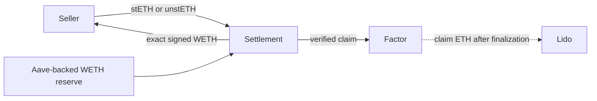

# Intentional

[](https://github.com/zkoranges/intentional/actions/workflows/ci.yml)
[](https://github.com/zkoranges/intentional/actions/workflows/production-fork-proof.yml)
[](https://intentional.so)

**Onchain factoring for delayed claims.**

Intentional lets a user sell a pending withdrawal right for WETH now. A factor
buys the claim, takes over the wait, and receives the eventual protocol payout.

[Open the app](https://intentional.so) ·
[Read the docs](https://intentional.so/docs) ·
[View the contracts](https://etherscan.io/address/0x906e0f4583834d44d55f26f0D6Ac842FafdCCcc5#code)

## How it works

Intentional currently supports two Lido routes:

- **Sell stETH now.** The settlement creates a canonical Lido withdrawal
  request owned by the factor and pays the seller WETH.
- **Sell an existing unstETH claim.** The settlement transfers the seller's
  withdrawal NFT to the factor and pays the seller WETH.

The factor signs a short-lived quote before the user submits a transaction.
Settlement acquires and verifies the claim first, then pays the exact signed
WETH amount. If any step fails, the complete transaction reverts.



Factor liquidity remains in Aave StataWETH until a payment is required. The
reserve withdraws only the amount needed for the accepted quote.

## Live status

Intentional is running a capped Ethereum mainnet pre-alpha:

- Claim range: `0.0005–0.005 stETH`
- Operator spread: `25 bps`
- Quote expiry: `10 minutes`
- Funding asset: `WETH`
- Reserve: `Aave StataWETH`

The current release is intentionally small and unaudited. The quote is an
operator price, not an oracle price or a guarantee that it beats a DEX.

### Mainnet contracts

| Contract | Address |
|---|---|
| Settlement kernel | [`0x906e…CCcc5`](https://etherscan.io/address/0x906e0f4583834d44d55f26f0D6Ac842FafdCCcc5#code) |
| Funding account | [`0x1Ca6…b713`](https://etherscan.io/address/0x1Ca68bC3D9c8Ff07e13A9013af9eC6A2c635b713#code) |
| Lido origination adapter | [`0xe32f…3f81`](https://etherscan.io/address/0xe32f43D326a4c104365D8C9ACC657c90C8E03f81#code) |
| Existing unstETH adapter | [`0x6451…91F`](https://etherscan.io/address/0x645193BC4748109f9A7e582B00ac7D41208BF91F#code) |
| ERC-4626 reserve adapter | [`0xD0c4…c40b`](https://etherscan.io/address/0xD0c4ee0851a39333E5696701C6cc902d7aCDc40b#code) |

All release addresses, runtime hashes, limits, and activation transactions are
recorded in
[`deployments/mainnet-pre-alpha-001.json`](deployments/mainnet-pre-alpha-001.json).

A real existing-claim sale completed on mainnet in
[`0x36de…4aa9`](https://etherscan.io/tx/0x36de5e1d760959462a5c78ea9215b17a67d03666ee4dcb1ecd34c59851ed4aa9):
unstETH `#130880` moved to the factor and the seller received exactly
`0.0049875 WETH` in the same transaction.

## Security model

The settlement contracts enforce:

- EIP-712 factor signatures
- Seller, factor, adapter, payment, claim data, nonce and deadline binding
- Seller-only execution
- Nonce replay protection
- Reserve-capacity checks
- Acquire-before-pay ordering
- Claim ownership and amount checks after transfer
- Exact seller WETH balance-delta verification
- Full rollback if acquisition or payment fails

These controls protect transaction atomicity. They do not guarantee a fair
price, quote availability, queue duration, eventual claim value, or the safety
of Lido, Aave, Ethereum, wallets, RPC providers, or the frontend.

**This code has not received an independent professional audit. Do not treat
the pre-alpha as suitable for unrestricted capital.**

See [`V2_THREAT_MODEL.md`](V2_THREAT_MODEL.md) and
[`docs/FUNDS_FLOW.md`](docs/FUNDS_FLOW.md) for the complete security boundary
and token flow.

## Development

### Requirements

- Foundry `1.7.1`
- Node.js `22.18` or newer
- GNU Make
- An archive-capable Ethereum RPC for fork tests

### Install

```sh
git clone --recurse-submodules https://github.com/zkoranges/intentional.git
cd intentional
npm --prefix frontend ci
npm --prefix services/quote-signer ci
forge build
```

### Run the app

```sh
cp frontend/.env.example frontend/.env.local
npm --prefix frontend run dev
```

The application is available at `http://localhost:3000`. Contract pins and
server-only quote infrastructure are documented in
[`frontend/README.md`](frontend/README.md).

### Test

```sh
forge fmt --check
make test
npm --prefix frontend run lint
npm --prefix frontend test
npm --prefix services/quote-signer test
```

Run canonical protocol tests against an Ethereum fork:

```sh
ETH_RPC_URL="https://your-archive-mainnet-rpc.example" make test-fork
```

Reproduce the complete deploy, quote, approval and fill flow on a disposable
chain-1 fork:

```sh
ETH_RPC_URL="https://your-archive-mainnet-rpc.example" make live-product-e2e
```

The manually dispatched
[production fork workflow](https://github.com/zkoranges/intentional/actions/workflows/production-fork-proof.yml)
runs the same no-mock protocol tests and end-to-end rehearsals in CI.

## Repository structure

```text
src/claims/             settlement kernel, funding account and claim interfaces
src/claims/adapters/    Lido and ERC-7540/ERC-8161 claim adapters
src/adapters/           ERC-4626 reserve adapter
services/quote-signer/  factor quote service and reservation accounting
frontend/               web app, quote verification and wallet execution
test/                   unit, integration, invariant and mainnet-fork tests
script/                 contract deployment and demonstration scripts
scripts/                release, rehearsal and operations tooling
deployments/            reviewed manifests and transaction evidence
docs/                   protocol, security and operations documentation
```

## Experimental modules

### ERC-7540 and ERC-8161

The repository includes an adapter for transferable asynchronous vault
requests, including requests that move from Pending to Claimable between quote
and execution. It is a standards reference; no production ERC-8161 vault is
claimed as supported.

### Uniswap payouts

The payout module can convert the factor's WETH into a seller-selected ERC-20
inside settlement. It is mainnet-fork tested and is not part of the live
deployment. See [`src/payouts/`](src/payouts/) and
[`uniswap_payouts_idea.md`](uniswap_payouts_idea.md).

### Aqua and SwapVM

The factoring fill does not execute through Aqua. This repository also
contains a separate Aqua/SwapVM maker engine that quotes from ERC-4626-backed
inventory and materializes output just in time. Its canonical Aqua mainnet fill
is recorded in
[`0xdfb6…4d37`](https://etherscan.io/tx/0xdfb6b280dfe8255ee3d0c4c74243ab9d9d4637b412926f1a9731654340f64d37).
See [`docs/AQUA_INTENT_DEMO.md`](docs/AQUA_INTENT_DEMO.md).

## Documentation

- [`docs/FUNDS_FLOW.md`](docs/FUNDS_FLOW.md) — settlement and token movement
- [`V2_SPEC.md`](V2_SPEC.md) — protocol specification
- [`V2_THREAT_MODEL.md`](V2_THREAT_MODEL.md) — assumptions and residual risks
- [`docs/V2_FORK_REALISM.md`](docs/V2_FORK_REALISM.md) — mainnet-fork methodology
- [`docs/LIVE_ACTIVATION.md`](docs/LIVE_ACTIVATION.md) — release procedure
- [`docs/QUOTE_DESK_OPS.md`](docs/QUOTE_DESK_OPS.md) — quote service operations
- [`docs/ETHGLOBAL_SUBMISSION.md`](docs/ETHGLOBAL_SUBMISSION.md) — project provenance

## License

Project-authored code is MIT unless a file states otherwise. SwapVM-derived
files and pinned dependencies retain their upstream licenses. See
[`THIRD_PARTY_NOTICES.md`](THIRD_PARTY_NOTICES.md) before redistribution.
