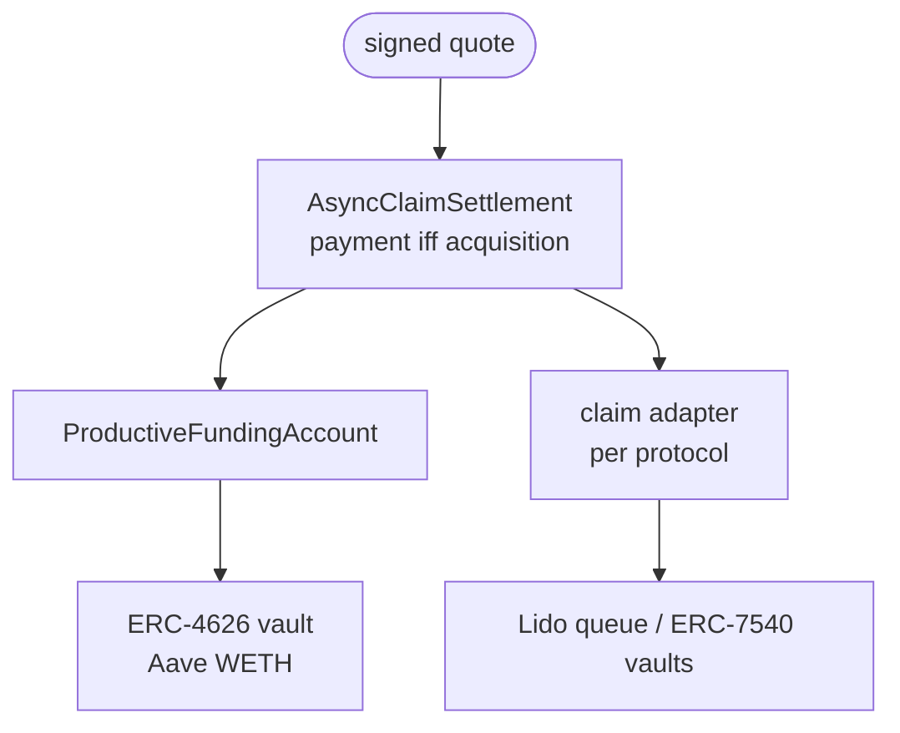

# Architecture

Four contracts, one invariant.

## AsyncClaimSettlement

The settlement kernel. It holds the invariant and knows nothing about Lido, Aave, or any specific vault. It checks:

- a valid factor signature, bound to this chain and this contract
- the caller is the named seller
- the nonce is unused, the deadline is live, and the quote is at most 15 minutes old
- funding covers the payment exactly; there are no partial fills
- the claim was measurably acquired before any payment moves
- one settlement per quote

Protocol-specific logic lives in adapters. Supporting a new claim type means writing an adapter; the kernel does not change.

## ProductiveFundingAccount

Keeps the factor's capital in an ERC-4626 vault and withdraws the exact payment on demand. It answers one question for the kernel: can this payment be delivered in full, right now? If anything is uncertain — the vault reverts, capacity is short, the account is paused — it reports zero and the fill never starts.

## Adapters

| Adapter | Claim | Action |
|---|---|---|
| `LidoWithdrawalClaimAdapter` | Lido withdrawal request | Creates a new request owned by the factor |
| `ERC8161RedeemClaimAdapter` | ERC-7540 redemption request | Transfers the Pending portion, redeems the Claimable portion |

Adapters confirm every acquisition by measuring balances before and after rather than trusting return values, because the underlying standards permit transfer fees and return nothing useful.

## 1inch Aqua and SwapVM

**The Aqua application.** Intentional ships a working Aqua / SwapVM strategy: a custom VM instruction (`0x92`) clamps swap output to what the maker's ERC-4626 reserve can currently deliver, so a maker can quote from yield-vault inventory instead of idle tokens. This path is proven against production Aqua contracts on a mainnet fork.

**The factoring path.** A factoring fill does not execute through SwapVM. The settlement kernel reuses the reserve engine built for the Aqua application: the same adapter holds the factor's WETH in an Aave vault, withdraws the exact payment inside the fill, and reports zero capacity on any uncertainty.

**Generalization.** The split is structural. A claim is not an ERC-20 and cannot be named in a SwapVM order, so claim settlement always needs the kernel and its adapters. Aqua fits on the factor side: competing factors are makers whose capital must earn between fills, which is what the reserve engine provides — for factoring and for any RFQ maker.

## Testing

187 deterministic tests (unit, integration, invariant) and 10 mainnet-fork suites pass. An invariant test moves a claim between Pending and Claimable between quote and fill; across 4096 randomized sequences, payment never occurs without complete acquisition. The Lido path runs against real mainnet contracts on a pinned fork: real stETH, the real withdrawal queue, real Aave.

## Going deeper

Every token movement, every validation gate and the error it reverts with, the
factor's capital cycle, and the live mainnet settlement decoded wei by wei are
documented with diagrams in
[`docs/FUNDS_FLOW.md`](https://github.com/zkoranges/intentional/blob/main/docs/FUNDS_FLOW.md).

---

**Next:** [Limits →](limits.md)
