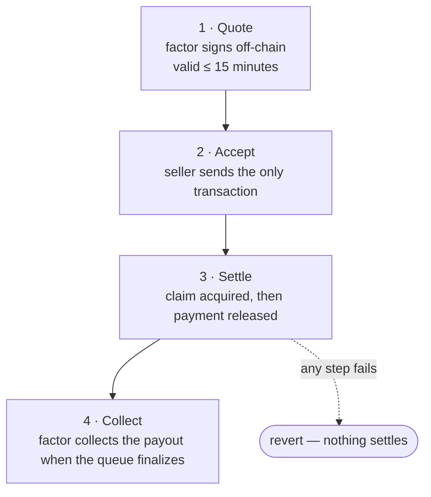
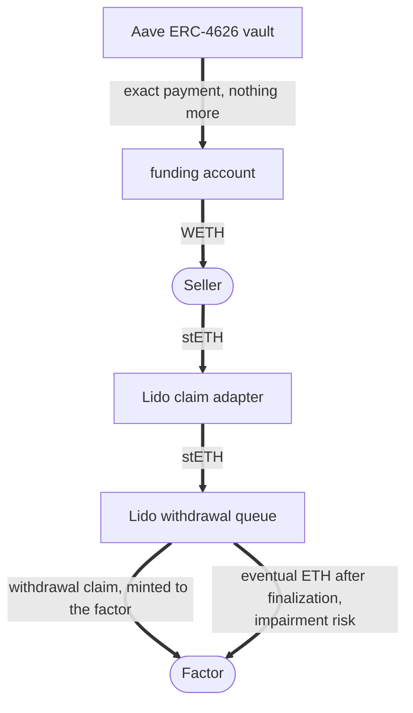

# How it works

Four steps, one onchain transaction.

## 1. Quote

The factor signs an EIP-712 offer offchain: a price for a specific claim, bound to a specific seller. The quote carries a nonce and a deadline and is valid for at most 15 minutes. The factor's key never sends a transaction.

## 2. Accept

The seller submits the signed quote to the settlement contract. This is the only transaction in the flow, and only the named seller can send it; a quote signed for one address cannot be used by another.

## 3. Settle

Inside that transaction, the contract:

1. verifies the signature, nonce, and deadline, and that the payment is fully funded
2. acquires the claim for the factor and measures that it arrived
3. withdraws the exact payment from the yield vault
4. pays the seller

If any step fails, everything reverts. No partially settled state exists.

Where the tokens actually go, in the Lido case:

## 4. Collect

When the queue finalizes, the factor collects what the queue actually pays — normally close to face value, but impairment is possible and stays with the factor. The difference between the collected amount and the quoted price is its return.

## Two kinds of claim

Intentional ships two adapters.

**Originate — the claim does not exist yet.** The seller holds stETH and wants ETH now. During settlement, the adapter converts the seller's stETH into a new Lido withdrawal request owned by the factor, while WETH is paid to the seller. The claim is created inside the settlement transaction, which a token exchange cannot do.

**Acquire — the claim already exists.** The seller has an ERC-7540 redemption request pending in a vault. A request can be partly Pending and partly Claimable at the same time, so the adapter handles both legs before payment is allowed: it transfers the Pending portion to the factor via [ERC-8161](https://ercs.ethereum.org/ERCS/erc-8161) and redeems the Claimable portion to the factor. Handling only one leg would lose value, so both are always required.

## Where the payment comes from

The factor's WETH sits in an Aave ERC-4626 vault, earning yield. It is withdrawn inside the settlement transaction, at the moment a deal settles. Before a fill the idle balance is zero; after a fill, only the exact payment has left and the rest keeps earning.

---

**Next:** [The factor →](factor.md)
