# Funds flow and settlement mechanics

This document traces where every token sits, moves, and settles in Reservoir
v2. It is written against the deployed source, not against the pitch: each
diagram is annotated with the contract and function that performs the step, and
the worked example uses the wei amounts from the mainnet settlement proof.

Read [`docs-site/README.md`](../docs-site/README.md) first if you want the
product idea. This document assumes you already know that a factor buys a
pending claim at a discount and collects the eventual ETH payout when the
queue finalizes it, subject to finalization timing and impairment risk.

**Contents**

1. [Actors and where value sits](#1-actors-and-where-value-sits)
2. [The invariant](#2-the-invariant)
3. [Path A — Lido origination (the mainnet-proven product)](#3-path-a--lido-origination-the-mainnet-proven-product)
4. [The mainnet settlement, wei by wei (proof record)](#4-the-mainnet-settlement-wei-by-wei-proof-record)
5. [Path B — ERC-7540/8161 acquisition (reference)](#5-path-b--erc-75408161-acquisition-reference)
6. [The factor's capital cycle](#6-the-factors-capital-cycle)
7. [The validation gauntlet](#7-the-validation-gauntlet)
8. [Path C — Aqua/SwapVM reserve clamp (v1 engine)](#8-path-c--aquaswapvm-reserve-clamp-v1-engine)
9. [Custody and authority](#9-custody-and-authority)
10. [Deployment and activation](#10-deployment-and-activation)
11. [Source map](#11-source-map)

---

## 1. Actors and where value sits

Reservoir deploys four contracts. Everything else in the diagram is canonical
mainnet infrastructure that Reservoir calls but does not control.

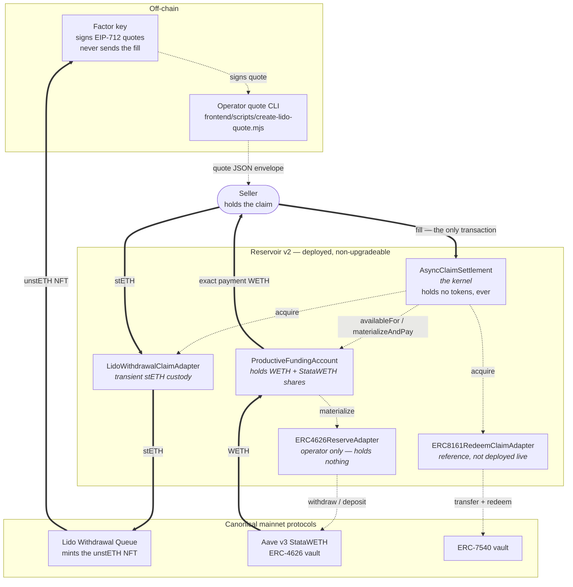

**Legend.** Thick arrows (`==>`) move tokens. Dotted arrows (`-.->`) are calls
or messages that move no value.

The two structural facts that matter most:

- **The kernel never holds tokens.** It sequences and verifies. Payment moves
  from `ProductiveFundingAccount` straight to the seller; the claim moves from
  the source protocol straight to the factor's `claimReceiver`. There is no
  intermediate balance to strand or steal.
- **The reserve adapter never holds tokens either.** It is an *operator* on the
  funding account's balances — the funding account grants it unlimited
  allowance on both WETH and vault shares at configuration time, and the
  adapter calls `vault.withdraw(shortfall, fundingAccount, fundingAccount)` so
  assets land directly in the account. `reinvest` reverts on any leftover dust
  in the adapter.

## 2. The invariant

> Payment happens if and only if the complete quoted claim is irrevocably
> acquired, in the same transaction.

Both directions are enforced, and the ordering is deliberate:

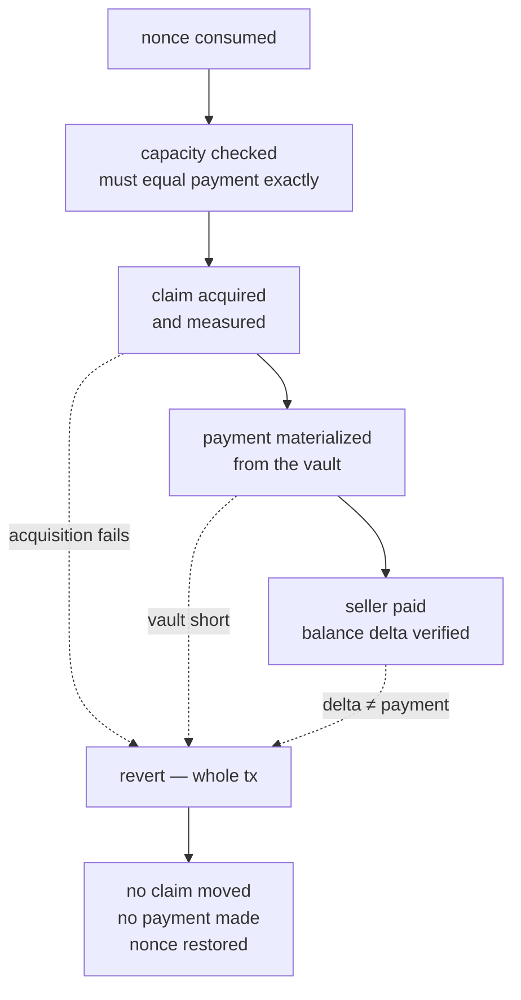

Acquisition precedes materialization on purpose. The factor's WETH stays in
Aave — earning — through the entire external claim call, and leaves the vault
only in the instant it must be paid. If anything after acquisition fails, the
whole transaction reverts and the claim operation unwinds with it.

## 3. Path A — Lido origination (the mainnet-proven product)

The seller holds stETH and wants ETH now. There is no pre-existing claim: the
withdrawal request is *created inside the settlement transaction* and minted
directly to the factor. A token swap cannot do this — which is the point.

### 3.1 Funds flow at a glance

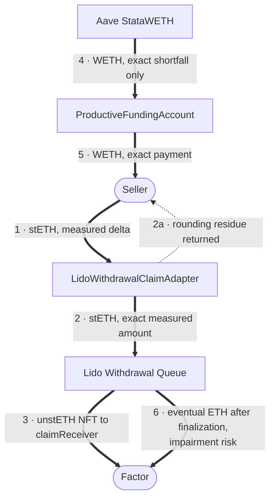

Steps 1–5 happen in one transaction. Step 6 happens days later, when the Lido
queue finalizes and the factor calls `claimWithdrawal` itself — Reservoir is
not involved and holds nothing in the meantime.

### 3.2 Exact sequence, part one — acquisition

Nothing in this half moves the factor's money. The claim is created and
verified first; the WETH is still earning in Aave throughout.

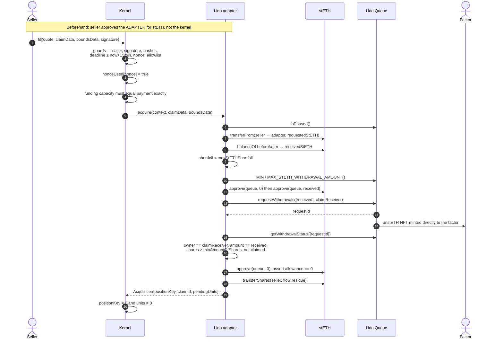

### 3.3 Exact sequence, part two — payment

Only now does capital leave the vault, and only the exact amount.

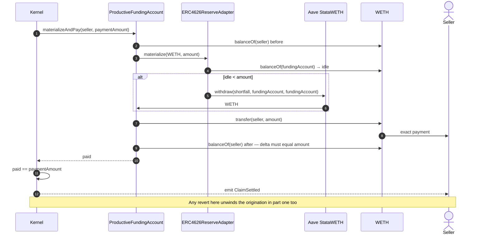

### 3.4 Why each measurement exists

| Measurement | Reason |
|---|---|
| stETH balance delta instead of the requested amount | stETH is a rebasing share token; `transferFrom` of *n* wei can deliver *n−1*. The request is originated on what actually arrived. |
| `maxStETHShortfall` bound | Caps how much drift the factor accepts between the quoted and delivered amount. Signed, so the seller cannot widen it. |
| `minAmountOfShares` floor | The claim's value is its **share** count, not its stETH face amount. A signed floor prevents a share-rate move between signing and fill from handing the factor less than it priced. |
| Live `MIN`/`MAX_STETH_WITHDRAWAL_AMOUNT` read from the queue | Lido's queue is an upgradeable proxy; the bounds are read at fill time, not hardcoded. |
| Request status re-read after `requestWithdrawals` | The return value is not trusted. Owner, amount, shares, and `isClaimed` are verified against the freshly minted request. |
| Allowance reset to zero and asserted | The adapter leaves no standing approval on the queue. |
| Residual shares returned to the seller | Any dust this flow created goes back. Shares donated to the adapter *before* the call are deliberately untouched and unrecoverable. |
| Seller WETH balance delta | Rejects fee-on-transfer payment assets and confirms the seller received exactly the signed amount. |

## 4. The mainnet settlement, wei by wei (proof record)

Settlement [`0x6c7dfd20…71d611`](https://etherscan.io/tx/0x6c7dfd20a40584cf2cb40baa27e98472599dbca62da470bab6bfd2b42071d611)
at block 25,611,746. Every number below is from
[`deployments/mainnet-v2.json`](../deployments/mainnet-v2.json) and the archived
quote envelope, and is reproducible by decoding the transaction.

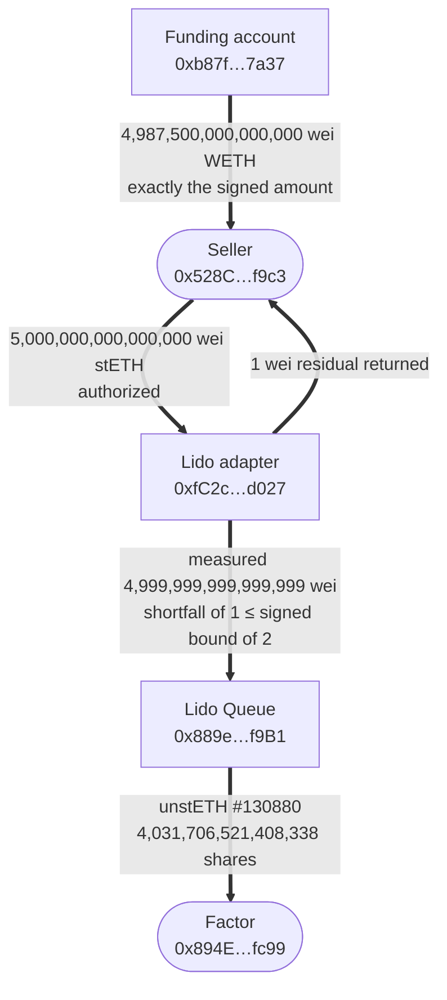

| Quantity | Value | Note |
|---|---:|---|
| stETH authorized | `5000000000000000` | 0.005 stETH, `claimData.requestedStETH` |
| stETH measured on arrival | `4999999999999999` | one-wei share rounding |
| `maxStETHShortfall` bound | `2` | signed; actual shortfall was 1 |
| Residual returned to seller | `1` | measured-delta protection, working |
| unstETH request | `#130880` | minted directly to the factor |
| `minAmountOfShares` floor | `4031706521408338` | ≈ 1.2402 stETH per share at fill |
| WETH paid to seller | `4987500000000000` | 0.0049875 WETH |
| Gross factoring spread | 25 bps | `(4999999999999999 − 4987500000000000) / 4999999999999999` |
| Queue at signing | 999.57 stETH unfinalized, 19 requests | operator context, not signed |

The first attempt at this settlement,
[`0xe2b5792d…`](https://etherscan.io/tx/0xe2b5792d443b30b2d7aa4a4582ed316ff26fe47518c4373d3d1380fefb69984e),
reverted: the client underprovided gas and exhausted it during the final WETH
payment, *after* the Aave withdrawal path had completed. Nothing settled
partially — the claim origination unwound with the payment, exactly as the
invariant requires. The fix was a client-side ×1.5 gas cushion, which is
operational hardening from a single observation and not a proven bound.

Only the eleven EIP-712 `ClaimQuote` fields are covered by the factor's
signature. The `pricing` block in the archived envelope is operator provenance
validated before signing, not signed data.

The sixth leg of the flow has not happened yet: the factor holds unstETH
#130880 and collects the eventual ETH payout when the Lido queue finalizes it
— subject to finalization timing and impairment risk; even this origination
landed one wei under par. That is the position the discount was charged for.

## 5. Path B — ERC-7540/8161 acquisition (reference)

The seller already has a redemption request pending in an ERC-7540 vault. A
request can be **partly Pending and partly Claimable at the same time**, and
those states are not exclusive — so the adapter always handles both legs before
payment is permitted. Handling only one would leave value behind.

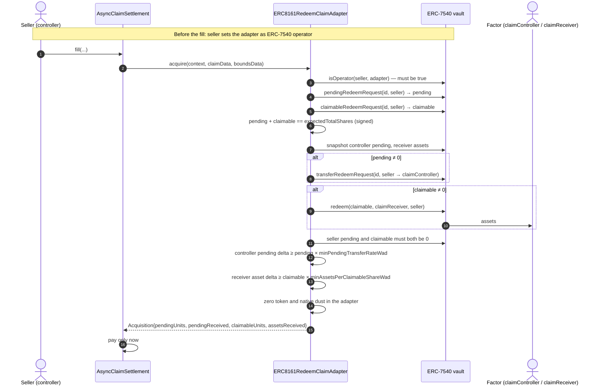

Deltas are authoritative throughout: ERC-7540 previews revert for asynchronous
redemption, and return values are not trusted. `requestId == 0` is rejected —
ERC-7540 permits a vault to aggregate all of a user's requests under ID zero,
which cannot identify a specific claim.

This adapter is a standards-conformant reference. **No production ERC-8161
endpoint is claimed**, and it was not part of the retired mainnet deployment
(the proof record in §4).

## 6. The factor's capital cycle

The factor is idle most of the time — factoring demand is episodic stress
liquidity, not a daily flow (an externally produced sample supporting this,
not reproduced here, is discussed in [`V2_ECONOMICS.md`](V2_ECONOMICS.md)).
Standby capital that earns nothing is expensive, so the reserve sits in an
ERC-4626 vault and only the exact payment ever leaves it.

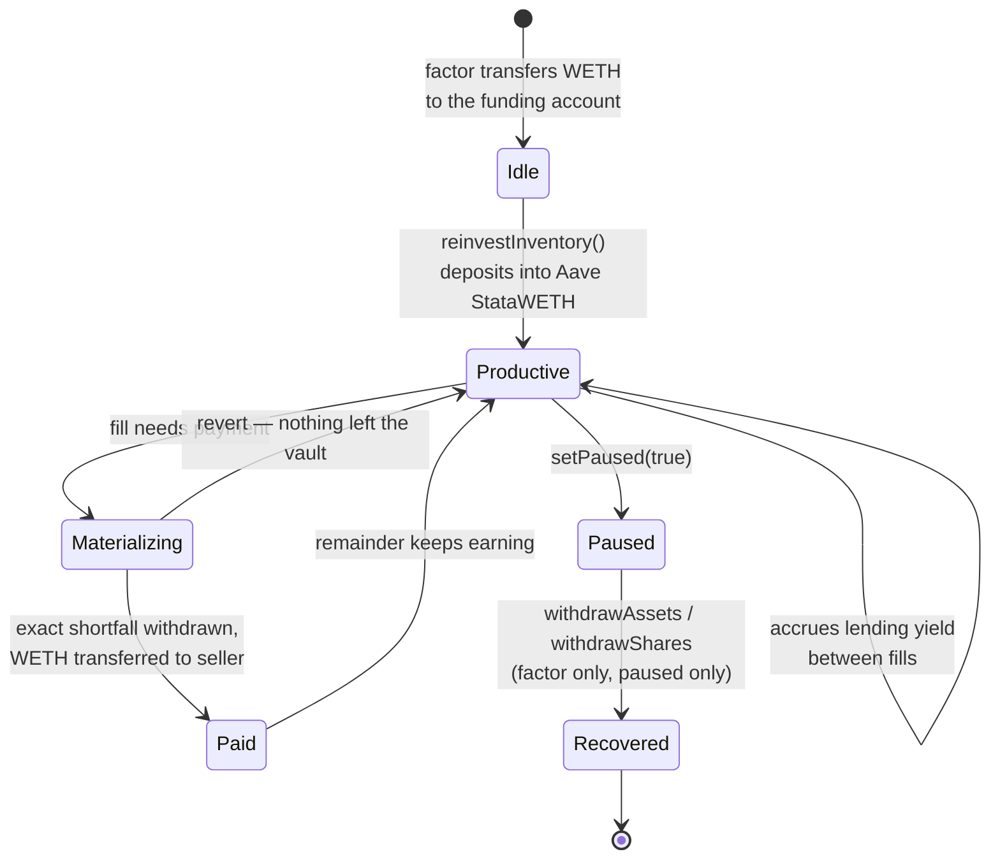

Two properties fall out of this design:

- **Idle WETH is spent first.** `materialize` uses the account's loose balance
  and withdraws from the vault only the shortfall, so a fill touches Aave as
  little as possible.
- **Capacity is fail-closed.** `availableFor` returns zero — not a revert — if
  the account is paused, unsealed, the vault reverts, or the reported exit cost
  is nonzero. The kernel then requires capacity to equal the payment *exactly*,
  so an uncertain reserve stops the fill before any claim moves.

The retired deployment closed its books and the arithmetic reconciles to the
wei:

| Reserve ledger | Wei |
|---|---:|
| Funded | `10000000000000000` |
| Paid to the seller | `4987500000000000` |
| Arithmetic remainder | `5012500000000000` |
| Actually recovered | `5012537039871751` |
| **Aave yield earned while standing ready** | **`37039871751`** |

That last row is the productive-reserve argument as a measured quantity rather
than a claim: the reserve was withdrawable on demand for the whole period *and*
earned while it waited. It is a tiny number because the demo was tiny; the
point is the sign, not the size.

The factor's position over time:

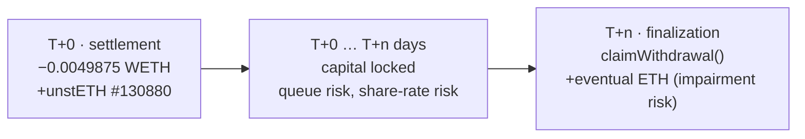

The discount pays for duration, impairment, queue-pause risk, gas, and the
opportunity cost of the locked capital. Those inputs are explicit configuration
in the operator CLI, not a model — see
[`docs-site/factor.md`](../docs-site/factor.md) for the pricing breakdown and
[`docs/V2_ECONOMICS.md`](V2_ECONOMICS.md) for the sampled calibration and its
stated limits.

## 7. The validation gauntlet

`fill` runs eighteen checks in a fixed order. Every one of them reverts the
entire transaction; there is no branch that settles partially.

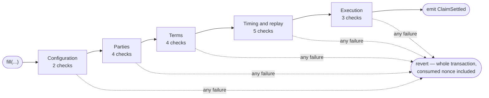

Only the last group performs external calls. Everything before it is pure or
view, so a malformed or stale quote costs the seller gas and nothing else.

| # | Phase | Check | Reverts with |
|---:|---|---|---|
| 1 | Configuration | not paused | `SettlementPaused` |
| 2 | Configuration | kernel sealed | `ConfigurationIncomplete` |
| 3 | Parties | `msg.sender == quote.seller` | `OnlySeller` |
| 4 | Parties | `quote.factor == factorSigner` | `QuoteFactorMismatch` |
| 5 | Parties | adapter is allowlisted | `InvalidAdapter` |
| 6 | Parties | claim destinations set, neither is the seller | `ClaimPartyMissing`, `ClaimControllerIsSeller`, `ClaimReceiverIsSeller` |
| 7 | Terms | `paymentAsset` equals the funding asset | `PaymentAssetMismatch` |
| 8 | Terms | `paymentAmount ≠ 0` | `InvalidPaymentAmount` |
| 9 | Terms | `keccak(claimData) == claimDataHash` | `ClaimDataHashMismatch` |
| 10 | Terms | `keccak(boundsData) == boundsHash` | `BoundsHashMismatch` |
| 11 | Timing | `now ≤ deadline` | `QuoteExpired` |
| 12 | Timing | `deadline ≤ now + 15 min` | `QuoteDeadlineTooFar` |
| 13 | Replay | `nonce ≥ nonceFloor` | `NonceBelowFloor` |
| 14 | Replay | nonce unused | `NonceAlreadyUsed` |
| 15 | Replay | EIP-712 signature valid (EOA or ERC-1271) | `InvalidFactorSignature` |
| 16 | Execution | capacity **equals** `paymentAmount` | `InsufficientCapacity` |
| 17 | Execution | acquisition returns a real position | `InvalidAcquisition` |
| 18 | Execution | seller's measured delta equals the payment | `InexactPayment` |

The nonce is consumed between check 15 and check 16 — before any external
call — so a reentrant path cannot replay the quote, and a revert rolls the
consumption back with everything else.

The signature binds the chain id and the kernel address through the EIP-712
domain, so a quote cannot be transplanted to another chain or another
deployment. It also binds `claimDataHash` and `boundsHash`, so the seller
cannot alter which claim is acquired or loosen any bound after signing.

The factor keeps three revocation levers that need no upgrade: `setPaused`,
`cancelNonce` for one quote, and `advanceNonceFloor` to invalidate every
outstanding quote below a watermark. `revokeAdapter` removes an adapter from
the allowlist. Every other binding — factor, funding account, payment asset —
is sealed at deployment.

## 8. Path C — Aqua/SwapVM reserve clamp (v1 engine)

Reservoir contains two production proofs built around productive reserves.
The Aqua proof executes through SwapVM. The async-claim settlement is a
separate v2 kernel and does not execute through Aqua.

Reservoir v1 is a separate engine and **not** part of a factoring fill. It
solves the maker-side half of the same problem: letting a market maker quote
from yield-bearing inventory instead of idle tokens.

A custom SwapVM instruction (opcode `0x92`) clamps swap output to what the
maker's ERC-4626 reserve can actually deliver right now.

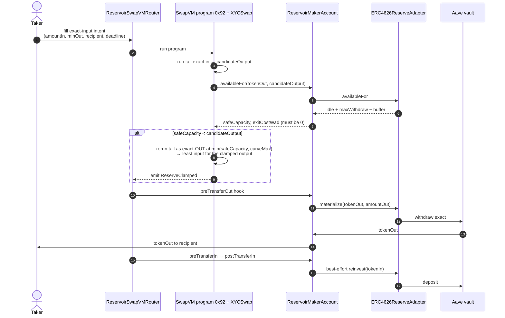

The hooks run against a per-order phase machine
(`NONE → OUTPUT_MATERIALIZED → INPUT_AUTHORIZED → NONE`) so the legs cannot be
reordered or replayed within a settlement, and `postTransferOut` is disabled
outright.

**Why factoring does not run through SwapVM.** A claim is not an ERC-20 and
cannot be named as a `sellToken` in a SwapVM order, so claim settlement always
needs the kernel and its adapters. The reuse is on the *funding* side: the same
`ERC4626ReserveAdapter` keeps the factor's WETH productive between fills. Aqua
generalizes the factor side — competing factors are makers whose capital must
earn between deals.

Proven on mainnet: intent fill
[`0xdfb6b280…f64d37`](https://etherscan.io/tx/0xdfb6b280dfe8255ee3d0c4c74243ab9d9d4637b412926f1a9731654340f64d37),
48,380,478,256,900 wei wstETH in → 57,142,857,142,857 wei WETH out, exactly
equal to the router's quote and above the 56,971,428,571,428 wei minimum. See
[`docs/AQUA_INTENT_DEMO.md`](AQUA_INTENT_DEMO.md).

## 9. Custody and authority

Who can hold value, and for how long:

| Contract | Holds | Duration |
|---|---|---|
| `AsyncClaimSettlement` | nothing | never |
| `ProductiveFundingAccount` | WETH, StataWETH shares | the reserve's whole life |
| `ERC4626ReserveAdapter` | nothing | asserted zero after every `reinvest` |
| `LidoWithdrawalClaimAdapter` | stETH | within one `acquire` call only |
| `ERC8161RedeemClaimAdapter` | nothing | zero dust asserted before returning |

Who can do what:

| Action | Authorized caller | Notes |
|---|---|---|
| `fill` | the named seller only | the factor never sends a transaction |
| `allowAdapter` / `revokeAdapter` | factor | mutable trust boundary, by design |
| `setPaused` (kernel and funding) | factor | stops new fills |
| `cancelNonce` / `advanceNonceFloor` | factor | revoke one or all outstanding quotes |
| `materializeAndPay` | the sealed kernel only | rejects every other caller |
| `materialize` / `reinvest` | the funding account only | reserve adapter is `onlyMakerAccount` |
| `acquire` | the kernel only | adapters are `onlySettlement` |
| `withdrawAssets` / `withdrawShares` | factor, **and only while paused** | recovery cannot race a live fill |

The seller approves the **adapter** for stETH, not the kernel — approval scope
is limited to the contract that actually pulls the token.

## 10. Deployment and activation

Deployment, funding, and activation are deliberately separate operations with
read-only verification between them.

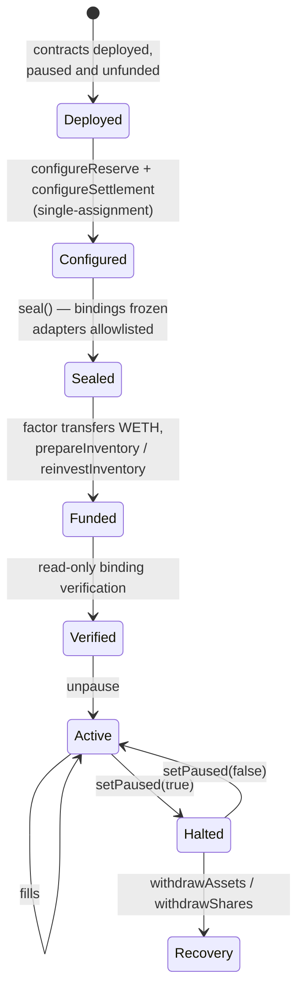

The mainnet deployment has now traversed that machine end to end and stopped:
the kernel and funding account are **paused**, the funding account holds zero
shares, and the factor holds all recovered WETH. The demo contracts are
retired — and cannot be reactivated: the factor signer key was exposed in a
working session transcript and `factorSigner` is immutable, so the
`Halted → Active` edge is permanently closed for this instance and it stays
paused and unfunded. Any future demo uses a fresh deployment with a fresh
key. One item is still outstanding — unstETH #130880, claimable after Lido
finalizes it, which is leg 6 of the flow in §3.1.

The `Paused → Recovered` edge is therefore not hypothetical; it was executed,
with receipts recorded in
[`deployments/mainnet-v2.json`](../deployments/mainnet-v2.json) under
`recovery`. Recovery is deliberately reachable only while paused, so it can
never race a live fill.

`seal()` on the kernel requires at least one allowlisted adapter, a sealed
funding account that points back at this kernel, and a configured payment
asset. After sealing, the factor address, funding account, and payment asset
cannot change — only the adapter allowlist, pause state, and nonce controls
remain mutable.

Live addresses, transaction hashes, and runtime code hashes are recorded in
[`deployments/mainnet-v2.json`](../deployments/mainnet-v2.json) and
[`deployments/mainnet-aqua.json`](../deployments/mainnet-aqua.json). The
activation procedure is frozen in [`docs/LIVE_ACTIVATION.md`](LIVE_ACTIVATION.md).

## 11. Source map

Every claim in this document traces to source:

| Topic | File |
|---|---|
| Gate order, nonce handling, `ClaimSettled` | [`src/claims/AsyncClaimSettlement.sol`](../src/claims/AsyncClaimSettlement.sol) |
| Capacity, materialization, pause, recovery | [`src/claims/ProductiveFundingAccount.sol`](../src/claims/ProductiveFundingAccount.sol) |
| Idle-first withdrawal, reinvest, dust checks | [`src/adapters/ERC4626ReserveAdapter.sol`](../src/adapters/ERC4626ReserveAdapter.sol) |
| stETH measurement, queue bounds, residue return | [`src/claims/adapters/LidoWithdrawalClaimAdapter.sol`](../src/claims/adapters/LidoWithdrawalClaimAdapter.sol) |
| Pending/Claimable legs, rate floors | [`src/claims/adapters/ERC8161RedeemClaimAdapter.sol`](../src/claims/adapters/ERC8161RedeemClaimAdapter.sol) |
| Reserve clamp instruction (`0x92`) | [`src/instructions/ReserveClamp.sol`](../src/instructions/ReserveClamp.sol) |
| Maker hooks and phase machine | [`src/accounts/ReservoirMakerAccount.sol`](../src/accounts/ReservoirMakerAccount.sol) |
| Normative behaviour | [`V2_SPEC.md`](../V2_SPEC.md) |
| Threats each control answers | [`V2_THREAT_MODEL.md`](../V2_THREAT_MODEL.md) |
| Fork realism, canonical/disposable boundary | [`docs/V2_FORK_REALISM.md`](V2_FORK_REALISM.md) |

---

Unaudited hackathon software. The diagrams describe what the deployed code
does; they are not a security review. Read
[`V2_THREAT_MODEL.md`](../V2_THREAT_MODEL.md) and
[`FINAL_V2_REVIEW.md`](../FINAL_V2_REVIEW.md) before trusting anything here
with funds.
